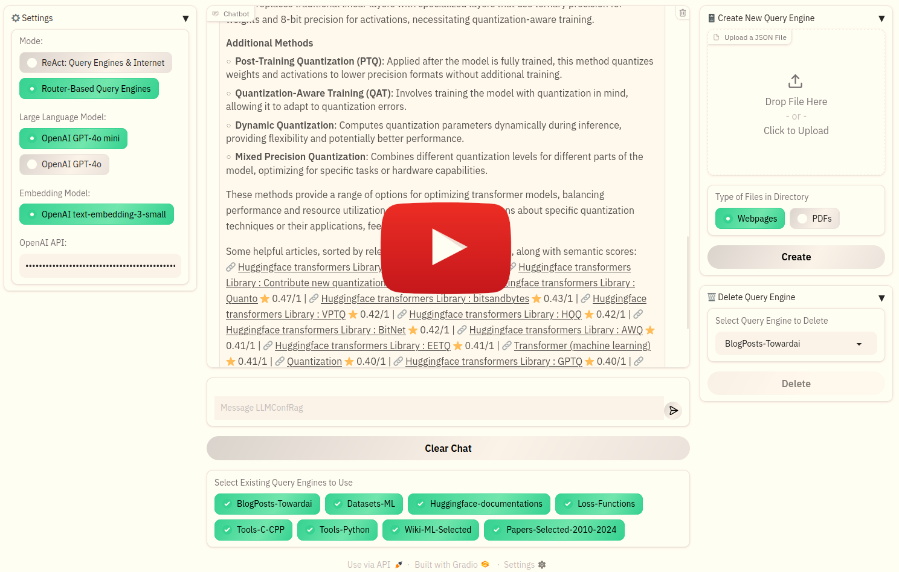

# Collection LLM RAG


## Project Overview

Collection-LLM-RAG is an project that fuses large language model (LLM) capabilities with retrieval-augmented generation (RAG) techniques.

At its core, **Collection-LLM-RAG** empowers users to create, manage, and interact with curated collections of documents across various topics. Each collection is a set of webpages or PDF files. By integrating a sophisticated retrieval system, the project allows the LLM to “ground” its responses in actual, domain-specific documents rather than solely relying on its static, pre-trained knowledge. This **dynamic augmentation** not only boosts the accuracy and relevance of generated outputs but also mitigates common issues like model hallucinations, outdated or incomplete internal knowledge, and the limitations imposed by finite context windows.

<p align="center">
  <a href="https://www.youtube.com/watch?v=yBf3TXbfR70">
    
  </a>
</p>

## Features

- **Custom Hybrid Search**: A hybrid search that combines semantic and keyword-based approaches to retrieve information relevant to a query. ChromaDB is used to store collection-related data, including embeddings, text content, source names, and source links.
- **Reranker**: An LLM acts as a judge to sort the retrieved texts according to their relevance to the query.
- **1st Mode: Router-Based Query Engines**: In this mode, a router-based query engine processes collections to answer the user's question using data retrieved from one or more collections that have the potential to contain answers.
- **2nd Mode: ReAct – Query Engines & Internet**: In this mode, a Reason and Act (ReAct) agent leverages LLM knowledge, collections, and a live internet search tool that retrieves webpages from DuckDuckGo's search results to provide answers.
- **Collection Management**: Each collection consists of a set of webpages or PDF files. Users can create or delete collections using the UI. When creating a new collection, the user must provide a JSON file—similar to the example files in the `Data/example-input-jsons/` folder—that includes a general description of documents in the collection as well as the name and URL of each webpage or PDF file.
- **Arbitrary Collection Topics**: The collections provided in the `Data/example-input-jsons/` folder are related to AI, ML, and deep learning. However, there are no restrictions, and users can create collections on any topic of their choice. Additionally, users can choose whether the model uses all available collections or only a subset when generating answers.
- **Web-based UI**: The program features an interactive web-based UI built with Gradio. This UI can be accessed locally or remotely.

Although various LLM and embedding models can be used, we selected OpenAI models; however, other models can be used with minimal changes. In the UI, there is a textbox where you can enter your OpenAI API key. Users can create new collections containing an arbitrary number of documents and choose any subset of a collection to answer a query, so the cost of the pipeline depends on several factors. However, for the eight sample collections in `Data/example-input-jsons/` folder, creating collections and extracting embeddings costs less than a dollar, and each query on all the eight sample collections averages around $0.015.

## Installation

To install the necessary dependencies, run:

```bash
python -m venv .venv
source .venv/bin/activate
pip install -r requirements.txt
```

## Usage

To run the main application, use the following command:

```bash
python main.py
```
After running the command, a Gradio link will appear in your terminal. Open this link in your browser to access and use the app.

## Notice
The source code for this project is released under the `MIT License`. See the LICENSE file for details.

Disclaimer for Example Query Engines: Please note that the query engine examples located in the `Data/query-engines` folder rely on publicly available data. Users should verify the data sources and any associated terms or conditions independently.
